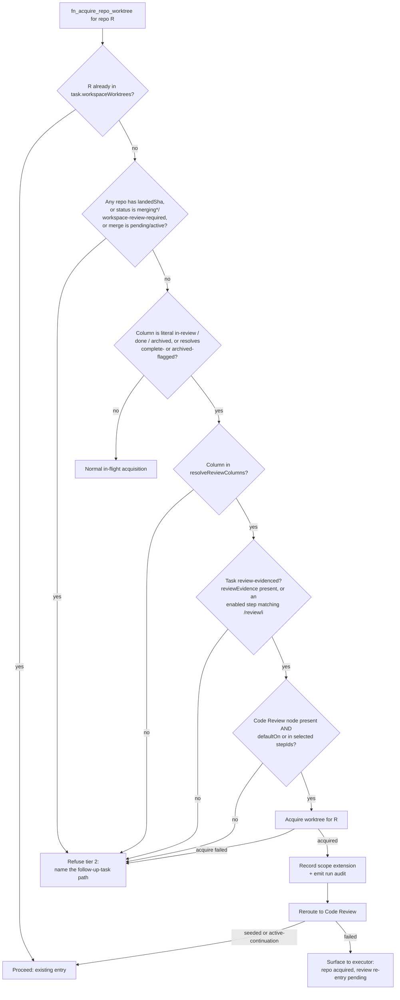
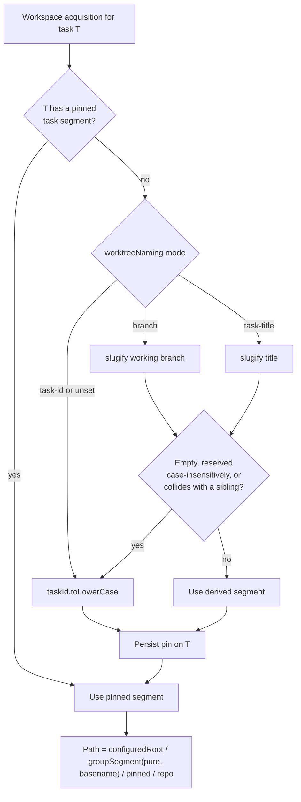

# Workspace Multi-Repo Parity - Plan

## Goal Capsule

**Objective.** Close the two requests from GitHub issue 3480 that Fusion's shipped multi-repository workspace work (tasks FN-9161 through FN-9165) left short: a defensible path for adding a repository to a task that has already reached review, and checkouts named after the ticket they serve rather than after a task id.

**Authority hierarchy.** `AGENTS.md` standing rules outrank this plan. Within this plan, an R-ID wins on product behavior and a KTD wins on implementation mechanism. The invariants recorded in `docs/workspaces.md` — recorded worktree paths are authoritative and are never migrated, landing is non-atomic and local-ref-only — outrank any unit that appears to contradict them.

**Execution profile.** Two threads that land as separate PRs. Each is self-contained: it carries its own changeset and rewrites the documentation its own behavior invalidates, so no PR merges asserting something the plan already made false. They share one file, named in Sequencing.

**Stop conditions.** Stop and surface rather than guessing when: a change would migrate or rewrite a recorded `task.workspaceWorktrees[*].worktreePath`; a change would allow a repository to land without review evidence; or the run-audit literal in KTD13 conflicts with an existing member of the `DatabaseMutationType` union.

**Tail ownership.** This plan does not own release. Per `AGENTS.md`, releasing is operator-only.

---

## Product Contract

### Summary

Two changes to the workspace feature. An executor that discovers another repository while its task sits in review can acquire it, at the cost of a forced return through Code Review — but not once landing has begun. A workspace task's checkout is named after its ticket rather than its task id, by honoring the `worktreeNaming` setting that single-repository tasks already respect.

### Problem Frame

The shipped workspace feature satisfies the letter of issue 3480 on five of six requests. The unmet one is late repository acquisition; the ticket-naming request was met only in a shape that does not match how the author names their work.

Adding a repository to a task after the fact works only while the task is still executing. Once it reaches a review column, `isWorkspaceRepoLateAcquireBlocked` refuses and directs the agent to file a follow-up task. The refusal is correct for a task whose repositories have started landing — landing is non-atomic, so a late scope change cannot be undone. It is over-broad for a task sitting in review with nothing landed, because Fusion already owns the machinery to force a scope-changed task back through Code Review.

Worktree paths carry no trace of what the work is. The issue author asked for checkouts under `~/worktrees/PRD-1234-my-slug` — a ticket slug, alongside a request for the branch `feature/PRD-1234-my-slug` derived from that same ticket. Fusion instead names the directory after the task id, and ignores the `worktreeNaming` setting that already lets single-repository tasks choose otherwise. The author's naming unit is the ticket, not the project.

**Evidence standing.** Measured against the maintainer's live instance on 2026-08-23: of 1,328 live tasks and 7,996 archived ones, **zero** have ever held a workspace worktree or a repository scope, and none of 449,249 run-audit rows carries a workspace mutation type. The workspace feature has never been exercised there. That does not mean it is unused — issue 3480 comes from a real operator running three repositories — but it does mean no local telemetry can size either thread, and none is claimed. The issue itself is the only evidence, which is why this plan covers exactly what the issue asks for and nothing adjacent.

### Requirements

**Task repository scope after review**

- R9. An executor can acquire a new sub-repository while its task is in a review column, provided no repository has a `landedSha`, the task is not merging, is not merge-pending, and is not awaiting workspace review.
- R10. A permitted late acquisition forces the task back through Code Review before it can land. If the workflow has no reachable Code Review node, the acquisition is refused instead.
- R11. The forced Code Review re-entry happens only after the repository is successfully acquired, never before.
- R12. Acquisition remains refused once any repository has landed or landing has begun. The refusal names the follow-up-task path.
- R13. A late acquisition is recorded as a repository-scope extension with its reason, and the resulting Code Review re-entry re-reviews **every** repository in scope, not only the new one.

**Worktree location**

- R14. A workspace task's worktree directory is named from its unit of work rather than its task id when the project's existing `worktreeNaming` setting selects a name-bearing mode. With a JIRA-derived branch `feature/PRD-1234-my-slug` and a configured root, the checkout lands at `<configured-root>/<workspace>/prd-1234-my-slug/<repo>`. Naming applies in both layouts; only the grouping level above it is opt-in.
- R15. A task's directory segment is fixed when it first acquires a workspace worktree. A later branch rename, title edit, or setting change never moves, re-derives, or invalidates that task's paths.
- R16. A segment that sanitizes to empty, that collides case-insensitively with a reserved container name, or that collides with a sibling task's live segment falls back to the task id rather than failing the acquisition.
- R17. The workspace group segment stays derived from the workspace directory basename and independent of any mutable setting, so grouped paths remain resolvable from settings alone.

### Scope Boundaries

**Deferred to follow-up work**

- Removing a repository from a workspace without an engine restart. There is no `removeWorkspaceRepo` today and membership only ever grows during a live run. This was scoped in full and cut: no operator has reported it, the feature it serves has no observed usage, and it is roughly three units of work including a new core primitive, a breaking change to the existing add route, and a new audit event. Revisit when someone asks.
- Prefilling a task's title and description from a JIRA issue. The branch-derivation half already shipped in FN-9165, and this thread would extend it with a bounded description read and an Atlassian Document Format flattener. Cut for the same reason, and because the fork between key-entry prefill and a JQL-backed issue picker was never settled with the operator — building the wrong arm is the expensive outcome.
- A JIRA issue picker or bulk importer. The GitHub equivalent is a 2,539-line modal (`packages/dashboard/app/components/GitHubImportModal.tsx`) plus eight routes; a JQL-backed picker is a comparable product surface and belongs in its own plan.
- Reclaiming an abandoned worktree group directory. No sweep can: the marker that proves ownership also permanently vetoes `isReclaimableWorktreeCandidate`, and workspace mode skips the walking sweeps entirely. Keeping the group segment pure (R17) means this plan creates no *new* abandoned groups, so the gap is pre-existing rather than introduced. Recorded in Open Questions as OQ2.
- Atomic per-repository merge of the `workspaceWorktrees` map, carried unresolved from `docs/plans/2026-06-21-005-feat-workspace-phase-b-plan.md:121-126` through Phase C and Phase D.

**Outside this change**

- Landing atomicity across repositories. Per-repository landing is deliberate and stays.
- Remote push of integration refs, permanently out per `docs/plans/2026-06-21-002-feat-workspace-mode-execution-model-plan.md:531`.
- Nested repository detection below one level.
- Changing the worktree layout when `worktreesDir` is unset. See KTD8.
- Moving `.ai-merge` under the grouped root. See KTD9.

### Open Questions

- OQ2 (deferred, pre-existing). Who reclaims an abandoned group directory? No sweep can, and a stale marker permanently fails closed any other workspace that later resolves to that segment. This plan does not make the situation worse — the group segment stays basename-derived — so the default is unchanged: the directory persists and is an operator-cleanup item. Worth its own fix, since the consequence is a hard acquisition failure rather than wasted disk.
- OQ3 (resolved). A permitted late acquisition re-reviews everything. `mutateTaskRepositoryScope` sets `reviewEvidence: undefined` for the whole task — not per repository — and `invalidateSupersededRepositoryScopeReviews` rewrites every prior code-review step result whose `repositoryScopeRevision` no longer matches to `status: "failed"`, clearing its verdict and findings (`packages/core/src/task-store/task-mutation-ops.ts:721`, `packages/core/src/tasks/repository-scope.ts:14-23`). This is recorded in R13 and priced in Risks; no further investigation is needed.

---

## Planning Contract

### Key Technical Decisions

- KTD6. **Late acquisition splits on landing evidence, and the blocked set keeps its hardcoded floor.** Governs R9, R12. Tier 1 re-admits only explicit `resolveReviewColumns(workflowIr)` membership — not merely "not blocked" — because the current `isLateAcquireColumnBlocked` folds review columns together with `done`, `archived`, and complete-flagged columns, and a zero-landed workspace task can legitimately sit in a complete lane. The literal `in-review`, `done`, and `archived` entries stay in the blocked set as a fail-safe: `resolveReviewColumns` is derived purely from `mergeOrchestration`/`mergeBlocker`/`humanReview` traits and returns an empty list for a traitless IR, so a trait-only blocked set would admit a malformed-workflow task to unrestricted acquisition. Tier 2 extends the current `merging|merging-pr|merging-fix` status set with `workspace-review-required` and with the merge-pending predicates self-healing already uses for this window.

- KTD6a. **Tier 1 requires the task to be review-evidenced, because the landing fence is conditional.** Governs R9, R13. The plan cannot rely on "no review evidence therefore `approval-missing` at landing": that fence evaluates only when `requiresRepositoryReviewEvidence` holds — the task already carries `repositoryScope.reviewEvidence`, or has an `enabledWorkflowSteps` entry matching `/review/i` (`packages/engine/src/merge/merger-ai.ts:2218-2222`). A legacy or direct-caller workspace task with neither is deliberately exempted there, so for that shape both halves of the mitigation are absent at once and an unreviewed repository lands silently. Tier 1 therefore proves the evidence-bearing shape at admission rather than inferring protection downstream.

- KTD7. **Reroute strictly follows a successful acquire; an unreachable Code Review node refuses before acquiring.** Governs R10, R11. The late-acquire predicate runs twice — an outer pre-check and again inside `validateTaskBeforeCreate` under the acquisition lock. If a `landedSha` lands between them, a reroute-first ordering would push the task back through Code Review for a repository it never acquired. An unreachable Code Review node must therefore be detected before acquiring and refused there, never handled as a post-acquisition unwind or as a warning — unwinding a completed acquisition would tear down a worktree that a live session may already be using. Reachability is not node presence alone: `rerouteWorkspaceReviewToCodeReview` also returns `no-code-review-route` when the node exists but is neither `defaultOn` nor in the task's selected `stepIds` (`packages/engine/src/merge/workspace-review-reroute.ts:27,33`), and a presence-only probe admits that second case straight into the non-unwinding path. `active-continuation` counts as success.

- KTD8. **Grouping stays opt-in behind a configured `worktreesDir`.** Governs the corresponding scope boundary; naming (R14) is independent of it. Changing the unset default would relocate every existing project's worktrees and add a directory level beneath three one-level `readdirSync` sweeps (`packages/engine/src/worktree/worktree-pool.ts:915`, `:1009`, `:1140`). The issue author asked for a custom root, so opt-in grouping covers the request completely.

- KTD9. **`.ai-merge` stays at the ungrouped configured root.** Governs the corresponding scope boundary. (session-settled: user-directed — chosen over folding it under the grouped root: it is Fusion-internal scratch rather than a directory the operator browses, and `isWorktreeContainerDir` already filters it out of every scan by name.)

- KTD10. **The task's directory segment is pinned on the task at first workspace acquisition.** Governs R15. `resolveWorkspaceTaskWorktreeDir` hardcodes `taskId.toLowerCase()` today, so the segment is stable by construction. Deriving it from the task's branch makes it time-varying — a branch rename mid-flight would re-derive a different directory on the next resolution, and the call sites that resolve workspace paths would disagree with each other and with what is on disk. Pin the resolved segment on the task at first acquisition and have every later resolution read the pin. This mirrors the shipped per-repository base-branch pin from FN-9164, where the recorded value wins over the task field for every later lifecycle stage. The **group** segment is deliberately left pure and basename-derived (R17), so archive disposal and the pi-extension candidate builder can still resolve grouped roots from settings alone, without a Task in hand.

- KTD11. **Segment derivation degrades to the task id; it never rejects.** Governs R16. A branch-derived name is operator-convenience, so an unusable one falls back rather than failing an acquisition. Fall back when `slugify` yields empty, when the result collides case-insensitively with a reserved container name, or when it collides with a sibling task's live segment. Case-insensitivity is load-bearing on the default macOS filesystem: `workspaceWorktreeGroupSegment`'s fast path returns any input matching `^[A-Za-z0-9._][A-Za-z0-9._-]*$` verbatim, so `.AI-Merge` would survive unchanged and resolve to the same directory as `.ai-merge`, while `isAiMergeContainerDir` compares `name === ".ai-merge"` case-sensitively and would stop filtering it out of the one-level sweeps KTD8 depends on. Note the empty-segment hazard is already guarded downstream — `workspaceWorktreeGroupSegment` returns `${sanitizePathSegment(base) || "workspace"}-${hash}` for any unsafe input, so `---`, `..`, and `///` yield `workspace-<hash8>`, never an empty path segment. Preserve that fallback; this KTD adds a readable name in front of it, not a replacement for it.

- KTD15. **Naming reuses the existing `worktreeNaming` setting rather than introducing a label.** Governs R14. Single-repo tasks already honor `worktreeNaming` (`random` / `task-id` / `task-title`) in `planTaskWorktreePath`; workspace tasks ignore it and hardcode the task id. Extending that setting with a branch-derived mode covers the request without a new settings key, without a new parity-test entry, and without a free-text path input from the operator. It also composes with the already-shipped JIRA branch derivation from FN-9165 by construction: an operator who derives `feature/PRD-1234-my-slug` from a ticket gets `prd-1234-my-slug` as the directory name with no second thing to configure. A per-project static label was rejected — the requested name identifies a unit of work, not a project, so a static setting would have to be edited before every task.

- KTD13. **The new run-audit literal follows the existing workspace families.** Governs R13. Metadata stays ids, counts, and fixed outcomes only, per the standing rule. Proposed literal: `task:workspace-scope-extended-post-review`, added to the `DatabaseMutationType` union in `packages/engine/src/util/run-audit.ts` and to the `AGENTS.md` Run Audit list, emitted through `emitBoundedRunAudit`. The curated catalogue at `packages/engine/src/run-audit/run-audit-catalogue.ts` is a delivery-pipeline subset and is not extended by this work.

- KTD16. **The merge-pending signal reaches the acquire tool through the existing provider seam.** Governs R9, R12. Tier 2 needs to know whether a merge is pending or active for the task, and neither predicate is importable: `activeMergeTaskId` is a private ProjectEngine field, and self-healing sees the predicates only because ProjectEngine pushes them onto the runtime (`setMergePendingProvider` at `packages/engine/src/project-engine.ts:900`, `setActiveMergeTaskIdProvider` at `packages/engine/src/runtimes/in-process-runtime.ts:2450`) which then injects them as options (`:1941`, `:1948`). `createAcquireRepoWorktreeTool` is constructed at `packages/engine/src/executor/run-implementation.ts:2069` from an opts bag carrying no engine handle. Reuse the provider seam that already exists rather than inventing a second one: thread the same runtime providers through the executor deps bag into the tool's opts as an optional predicate. Absent provider means "not merge-pending" — the same fail-open default self-healing already takes — so a runtime that never wires it degrades to today's status-only check rather than refusing every acquisition. Wire it at every engine-construction site; an optional parameter no caller passes is indistinguishable from no change, and its seam test still passes.

### High-Level Technical Design

The late-acquisition gate is the highest-risk decision surface in this plan: it has five decision points, three of which are new, and an ordering constraint between the acquisition and the reroute.

The task's directory segment moves from a hardcoded task id to a pinned, branch-derived name. The group segment above it stays pure so grouped roots remain resolvable without a Task.

### Surface Enumeration

Required by the FN-5893 standing rule: this plan adds a UI affordance (a new naming mode) and changes a refusal.

- **Late acquisition.** Review column with nothing landed; review column with one repository landed; complete or archived column with nothing landed; a literal `in-review` column under an IR resolving no review columns; a task carrying no review evidence; merging and merge-pending windows; workflow without a Code Review node; workflow whose Code Review node is present but unselected; acquisition failure after the tier-1 decision; reroute failure after a successful acquire; two acquisitions in the same tick.
- **Directory naming.** Each `worktreeNaming` mode including unset; a branch that slugs to empty; a slug matching a reserved container name in any case; two live tasks slugging identically; a branch renamed after acquisition; `worktreesDir` set and unset; `recycleWorktrees` enabled. Every call site that resolves a workspace task directory — `agent-tools.ts`, `worktree-acquisition.ts`, `run-implementation.ts`, `run-graph-custom-node.ts` (two sites), `archive-lifecycle.ts`, `extension.ts` — must read the pin rather than re-derive.
- **Breakpoints.** The `worktreeNaming` control renders at desktop and mobile breakpoints (`(max-width: 768px), (max-height: 480px)`).

### Risks and Dependencies

- **U4 relaxes a review-integrity boundary, and the mitigation is expensive.** A permitted late acquisition forces Code Review re-entry, and per OQ3 that re-entry is a **full re-review of every repository in scope** — the scope mutation clears the task's whole `reviewEvidence` map and fails every prior code-review step result, not just the new repository's. So the operator's choice at that moment is: accept a full re-review, or file the follow-up task the current refusal already directs them to. U4 is worth building only if a full re-review is meaningfully cheaper than a follow-up task for the executor's actual case; that judgement should be made explicitly rather than assumed. Separately, if either half of the guard regresses, an unreviewed repository can land — the ordering test and the review-evidenced admission check in U4 are what hold that closed.
- **A branch rename mixes layouts inside one task if the pin is bypassed.** Without KTD10, `isLegacyWorkspaceWorktreeLayout` would compare recorded paths against a newly derived task directory and classify every pre-rename task as legacy, so a mid-flight acquisition after a rename would land in the per-repository layout while its siblings sit in the grouped one. Pinning removes the failure by construction. This is why KTD10 is a prerequisite for U6 rather than an optimization, and why U5's characterization test gates the thread. Keeping the *group* segment pure (R17) closes the companion hazard: a mutable group segment would strand pi-extension sessions, whose candidate builder resolves grouped roots from settings alone and is forbidden from recovering by parent trimming.
- **Dependency: the atomic per-repository `workspaceWorktrees` merge is still open.** U4 mutates that map. It works around the gap by re-reading under the acquisition lock, as Phase A's mitigation does; it does not resolve it.

### Assumptions

- `task:workspace-scope-extended-post-review` is not already a member of the `DatabaseMutationType` union. The implementer verifies before adding.

### Sequencing

Two independent threads.

1. Task scope after review: U4.
2. Worktree location: U5, then U6.

**Each thread PR carries its own changeset and its own documentation edits.** The late-acquisition PR rewrites the `docs/workspaces.md` sentence stating that tasks in review refuse late acquisition, and adds its run-audit literal to `docs/run-audit.md` and the `AGENTS.md` Run Audit list. The layout PR updates the worktree-layout section of `docs/workspaces.md` and the `worktreeNaming` row in `docs/settings-reference.md`. A thread that lands without them leaves the docs asserting behavior it just removed, and `AGENTS.md` requires a changeset on every change affecting the published package.

**One shared file.** U4 and U5 both edit `packages/engine/src/agent-tools.ts` — U4 the late-acquire classifier, U5 the workspace-task-directory call site. They do not overlap within the file, but land one thread before rebasing the other rather than resolving in both directions.

U5 is a behavior-preserving refactor and is the safest early integration point if the implementer wants one.

---

## Implementation Units

### U4. Two-tier late repository acquisition

**Goal.** Allow acquiring a new sub-repository during review when nothing has landed, forcing a return through Code Review, and keep refusing once landing has begun.

**Requirements.** R9, R10, R11, R12, R13.

**Dependencies.** None.

**Files.**
- `packages/engine/src/agent-tools.ts`
- `packages/engine/src/merge/workspace-review-reroute.ts`
- `packages/engine/src/util/run-audit.ts`
- `packages/engine/src/project-engine.ts`
- `packages/engine/src/runtimes/in-process-runtime.ts`
- `packages/engine/src/executor/deps-bags.ts`
- `packages/engine/src/executor/run-implementation.ts`
- `docs/workspaces.md`
- `docs/run-audit.md`
- `AGENTS.md`
- `.changeset/fn-workspace-late-acquire.md` (new)
- `packages/engine/src/__tests__/workspace-late-acquire-tiers.test.ts` (new)
- `packages/engine/src/__tests__/workspace-add-repo-midflight.test.ts`
- `packages/dashboard/src/__tests__/workspace-documentation.test.ts`

**Approach.**
1. Split `isWorkspaceRepoLateAcquireBlocked` into a classifier returning `allowed`, `allowed-with-review-reentry`, or `blocked`, with the reason carried alongside.
2. `blocked` covers: any entry with a `landedSha`; status in `merging`, `merging-pr`, `merging-fix`, or `workspace-review-required`; a merge pending or active for this task; and the literal lifecycle columns `in-review`, `done`, and `archived` plus any column resolved as complete-flagged or archived-flagged. Keep the three literals even though step 3 re-admits review columns: `resolveReviewColumns` derives purely from workflow traits and returns an empty list for a traitless or partly-migrated IR, so dropping them lets such a task fall through both tiers into unrestricted acquisition — strictly worse than today's refusal.
3. `allowed-with-review-reentry` re-admits a task out of the blocked set only when all three hold, each probed before acquiring:
   - the column is in `resolveReviewColumns(workflowIr)`;
   - the task carries a review-evidence-bearing shape — `repositoryScope.reviewEvidence` present, or an `enabledWorkflowSteps` entry matching `/review/i` — per KTD6a;
   - a Code Review node is reachable, meaning present **and** either `config.defaultOn === true` or its id in the task's workflow selection `stepIds`, per KTD7.
   Any failure refuses. The reachability probe must replicate the reroute's whole refusal condition, not just node presence.
4. Thread the merge-pending signal into the tool per KTD16: expose the runtime's existing merge-pending and active-merge providers through the executor deps bag and pass an optional predicate into `createAcquireRepoWorktreeTool`'s opts at its construction site. Wire it at every engine-construction site, not just the one the tests exercise. An absent provider means "not merge-pending", degrading to today's status-only check.
5. Keep the classifier in both existing call positions — the outer pre-check and the `validateTaskBeforeCreate` re-check under the acquisition lock. The inner call remains authoritative.
6. Order the side effects strictly: acquire, then record the scope extension via `mutateTaskRepositoryScope`, then emit `task:workspace-scope-extended-post-review` via `emitBoundedRunAudit`, then reroute. A reroute failure after a successful acquire returns a non-error result to the executor that names the acquired repository and the pending review re-entry; it does not unwind the acquisition.
7. Treat a `seeded` or `active-continuation` reason as success (`rerouted` is the boolean, not the reason literal). Treat `no-code-review-route` as a pre-acquisition refusal, which step 3 has already prevented from reaching this point.
8. Keep the tier-2 refusal text pointing at `fn_task_create`, and add the blocking reason so the executor can tell "already landed" from "already merging".
9. Rewrite the `docs/workspaces.md` sentence that says tasks in review or merging refuse late acquisition, resolving it in place rather than layering a correction, and state the full-re-review cost so an operator can weigh it. Add the run-audit literal to `docs/run-audit.md` and the `AGENTS.md` Run Audit list, and extend `workspace-documentation.test.ts` with any symbol it should pin.

**Execution note.** The ordering constraint in step 6 is the invariant this unit exists to protect. Write a test that forces a `landedSha` to appear between the outer and inner checks before writing the implementation.

**Test scenarios.**
- A task in a review column with no `landedSha` acquires a new repository, records a scope extension, and is rerouted to Code Review.
- The same task with one repository carrying a `landedSha` is refused, and the refusal names the follow-up-task path.
- A task with status `merging`, `merging-pr`, `merging-fix`, or `workspace-review-required` is refused.
- A task with a pending or active merge is refused even when its column and status would otherwise permit acquisition, driven through the injected predicate rather than a status read.
- With no merge-pending provider wired, the classifier falls back to the status-only check and does not refuse every acquisition — proving the optional seam degrades rather than fails closed.
- The predicate reaches the tool from a real engine construction, not only from a test-constructed opts bag, so the seam cannot pass its unit test while being unwired in production.
- A task in a `done` or complete-flagged column with no `landedSha` is refused.
- A workflow with no Code Review node refuses before acquiring; no worktree is created and no scope extension is recorded.
- A workflow whose Code Review node exists but is neither `defaultOn` nor in the task's selected `stepIds` refuses before acquiring, proving the probe matches the reroute's full refusal condition rather than node presence alone.
- A task in a review column carrying neither `repositoryScope.reviewEvidence` nor an `enabledWorkflowSteps` entry matching `/review/i` is refused, rather than admitted on the assumption that landing would later report `approval-missing`.
- A task in the literal `in-review` column under a workflow IR whose `resolveReviewColumns` resolves empty is refused, not admitted to unrestricted acquisition.
- A `landedSha` appearing between the outer and inner checks causes the inner check to refuse; no reroute has fired.
- A reroute returning `active-continuation` is treated as success.
- A reroute failure after a successful acquire leaves the worktree acquired, the scope extension recorded, and returns a result naming the pending review re-entry.
- Two acquisitions in the same tick produce one seeded continuation; the second reports the existing continuation rather than an error.
- Exactly one `task:workspace-scope-extended-post-review` row is emitted per permitted late acquisition, with ids and outcomes only.
- After a permitted late acquisition, every repository's prior code-review step result is invalidated, not only the newly acquired one — pinning the full-re-review cost recorded in R13.

**Verification.** Both tier boundaries hold under the ordering test, and an existing in-flight acquisition in a non-review column behaves exactly as before.

---

### U5. Pin the workspace task directory segment

**Goal.** Resolve the task's directory segment once and persist it, so every call site agrees even after the input changes. Behavior-preserving.

**Requirements.** R15.

**Dependencies.** None.

**Files.**
- `packages/core/src/tasks/worktree-layout.ts`
- `packages/core/src/types/task/task-core.ts`
- `packages/core/src/index.ts`
- `packages/core/src/index.gate.ts`
- `packages/core/src/task-store/archive-lifecycle.ts`
- `packages/cli/src/extension.ts`
- `packages/engine/src/worktree/worktree-acquisition.ts`
- `packages/engine/src/worktree/worktree-paths.ts`
- `packages/engine/src/agent-tools.ts`
- `packages/engine/src/executor/run-implementation.ts`
- `packages/engine/src/executor/run-graph-custom-node.ts`
- `packages/core/src/__tests__/worktree-layout.test.ts`
- `packages/engine/src/__tests__/worktree-acquisition-workspace.test.ts`

**Approach.**
1. Add an optional persisted field to the task recording its resolved directory segment.
2. Change `resolveWorkspaceTaskWorktreeDir` to accept an already-resolved segment instead of lowercasing the task id inline. Leave `workspaceWorktreeGroupSegment` and `resolveWorktreesDirLayout` alone — the group segment stays pure and settings-independent per R17, which is what keeps archive disposal and the pi-extension candidate builder working without a Task.
3. Mint and persist the segment at first workspace acquisition. A task with a pin uses it unconditionally.
4. A task with no pin — every task that exists today — mints `taskId.toLowerCase()`, reproducing current behavior exactly.
5. Update every call site that resolves a workspace task directory to pass the pinned segment. The full set is `agent-tools.ts`, `worktree-acquisition.ts`, `run-implementation.ts`, `run-graph-custom-node.ts` (two sites), `archive-lifecycle.ts`, and `extension.ts`; a site left deriving its own segment reintroduces the split-directory failure this unit exists to prevent.

**Execution note.** This unit changes no paths. Prove that first: a characterization test asserting a task with no pin resolves byte-identical paths before and after the change is the gate for the rest of the thread.

**Test scenarios.**
- A task with no pinned segment resolves the same task directory as the current implementation, for a safe workspace basename and for an unsafe one requiring the sanitize-plus-hash form.
- First acquisition persists the pin, and the persisted value matches the directory actually created.
- A second acquisition for another repository in the same task reuses the pin without re-deriving it.
- A task whose recorded paths predate pinning still classifies as legacy layout and keeps its recorded paths.
- Every call site listed in step 5 resolves the same path for the same task; none derives its own segment.
- Archive disposal and the pi-extension candidate builder still resolve the grouped root with no Task available, proving the group segment stayed pure.
- Minting runs in both layouts: `resolveWorkspaceTaskWorktreeDir` takes the pinned segment whether `worktreesDir` is set or unset, since only the grouping level above it is opt-in.

**Verification.** `pnpm --filter @fusion/engine exec vitest run src/__tests__/worktree-acquisition-workspace.test.ts src/__tests__/worktree-paths.test.ts src/__tests__/worktree-pinning.test.ts` passes unchanged, and the characterization test proves path equality.

---

### U6. Ticket-derived workspace worktree directory names

**Goal.** Name a workspace task's checkout after its unit of work, by honoring the project's existing `worktreeNaming` setting instead of hardcoding the task id.

**Requirements.** R14, R16, R17.

**Dependencies.** U5.

**Files.**
- `packages/core/src/types/settings/settings-scope.ts`
- `packages/core/src/config/settings-schema.ts`
- `packages/core/src/tasks/worktree-layout.ts`
- `packages/engine/src/worktree/worktree-names.ts`
- `packages/engine/src/worktree/worktree-acquisition.ts`
- `packages/dashboard/app/components/settings/sections/WorktreesSection.tsx`
- `packages/dashboard/app/components/settings/sections/WorktreesSection.search.ts`
- `docs/settings-reference.md`
- `docs/workspaces.md`
- `.changeset/fn-workspace-ticket-naming.md` (new)
- `packages/core/src/__tests__/workspace-worktree-naming.test.ts` (new)
- `packages/engine/src/__tests__/worktree-acquisition-workspace.test.ts`

**Approach.**
1. Add a `branch` mode to the existing `worktreeNaming` enum. No new settings key, so the parity test's derived key list is unaffected; document the new value on the existing `worktreeNaming` row in `docs/settings-reference.md`.
2. In U5's mint step, derive the segment by mode: `branch` slugs the task's working branch through the existing `slugify`, dropping any leading namespace so `feature/PRD-1234-my-slug` becomes `prd-1234-my-slug`; `task-title` slugs the title; `task-id` and unset keep `taskId.toLowerCase()`. Reuse `resolveTaskWorkingBranch` so an operator-supplied or JIRA-derived branch is the input, and mint after the branch is resolved.
3. Fall back to `taskId.toLowerCase()` — never fail the acquisition — when the slug is empty, matches a reserved container name case-insensitively (`.ai-merge`, `.fusion-recovery`, `.worktrees`, `.fusion-workspace-root`), or collides with a sibling task's live segment under the same group. Record the fallback reason in the task log.
4. Leave `workspaceWorktreeGroupSegment` and the acquisition-time `WorkspaceWorktreeGroupConflictError` marker check untouched. The group segment stays basename-derived per R17.
5. Surface the new mode in `WorktreesSection`'s existing `worktreeNaming` control and its search index. Honor the existing `assertWorktreeNamingRecycleExclusive` write-boundary rule, which already makes `worktreeNaming` and `recycleWorktrees` mutually exclusive — the new mode inherits that constraint rather than adding one.
6. Update the worktree-layout section of `docs/workspaces.md` for ticket-derived directory names and the pinned segment.

**Execution note.** The interesting behavior is the fallback ladder, not the happy path. Drive it test-first from the scenarios below.

**Test scenarios.**
- With `worktreeNaming: "branch"` and branch `feature/PRD-1234-my-slug`, a newly acquired workspace task's checkout lands at `<configured-root>/<workspace>/prd-1234-my-slug/<repo>`.
- A branch with no namespace (`PRD-1234-my-slug`) yields the same segment.
- A branch that slugs to empty falls back to the task id and logs the reason.
- A branch slugging to `.AI-Merge`, `.Fusion-Recovery`, or any case variant of a reserved name falls back to the task id, proving the check is case-insensitive on the minted segment rather than a literal comparison.
- Two live tasks whose branches slug identically get distinct directories: the first keeps the slug, the second falls back to its task id.
- Renaming the branch after acquisition does not move or re-derive the task's directory.
- `worktreeNaming: "task-id"` and an unset value both reproduce today's path exactly.
- `worktreeNaming: "task-title"` slugs the title for a workspace task, matching the single-repo behavior that already exists.
- With `worktreesDir` unset, the mode still names the task directory — the checkout lands at `<workspace>/.fusion/worktrees/prd-1234-my-slug/<repo>` — proving naming is independent of the grouping that KTD8 keeps opt-in.
- The settings parity test passes unchanged, since no key was added.
- Setting the new mode while `recycleWorktrees` is enabled is refused by the existing exclusivity assertion.
- The mode renders in `WorktreesSection` at desktop and mobile breakpoints.

**Verification.** `pnpm --filter @fusion/core exec vitest run src/__tests__/settings-parity.test.ts src/__tests__/workspace-worktree-naming.test.ts` passes, and `docs/settings-reference.md` documents the new mode on the existing `worktreeNaming` row.

---

## Verification Contract

Scope every run to the changed files per the standing rule. Do not pass `allowFullSuite`.

| Gate | Command | Applies to |
| --- | --- | --- |
| Late acquisition tiers | `pnpm --filter @fusion/engine exec vitest run src/__tests__/workspace-late-acquire-tiers.test.ts src/__tests__/workspace-add-repo-midflight.test.ts --silent=passed-only --reporter=dot` | U4 |
| Worktree layout | `pnpm --filter @fusion/engine exec vitest run src/__tests__/worktree-acquisition-workspace.test.ts src/__tests__/worktree-paths.test.ts src/__tests__/worktree-pinning.test.ts src/__tests__/worktree-pool.test.ts --silent=passed-only --reporter=dot` | U5, U6 |
| Settings parity and naming | `pnpm --filter @fusion/core exec vitest run src/__tests__/settings-parity.test.ts src/__tests__/worktree-layout.test.ts src/__tests__/workspace-worktree-naming.test.ts --silent=passed-only --reporter=dot` | U5, U6 |
| Documentation contracts | `pnpm --filter @fusion/dashboard exec vitest run src/__tests__/workspace-documentation.test.ts --silent=passed-only --reporter=dot` | both threads |
| Changeset format | `pnpm check:changesets` | both threads |
| Merge gate | `pnpm test:gate` | both threads before merge |
| Non-test verification | `pnpm verify:fast` | both threads before merge |

Stale-test sweep, required by the behavior-change standing rule and not covered by any command above: this plan removes a documented refusal. Before finishing U4, grep for fixtures and assertions that encode "a review-column acquisition is refused". Fix at the shared workspace fixture rather than per test. A green targeted run is not evidence that no test still encodes the old behavior.

---

## Definition of Done

Global:

- Every requirement R9 through R17 is implemented or explicitly deferred in Open Questions.
- No recorded `task.workspaceWorktrees[*].worktreePath` is migrated, rewritten, or invalidated by any unit.
- The new run-audit emitter uses `emitBoundedRunAudit` and carries ids, counts, and fixed outcomes only.
- Each thread PR carries its own changeset and its own documentation edits.
- FNXC comments record the requirement behind each behavioral change, timestamped from `date -u`.
- Stale tests asserting the removed refusal are updated or deleted in the same change, fixed at the shared fixture.
- Abandoned experimental code from approaches that did not pan out is removed before declaring done.
- `pnpm test:gate` and `pnpm verify:fast` pass.

Per unit:

| Unit | Done signal |
| --- | --- |
| U4 | Tier boundaries hold, including a `landedSha` appearing between the outer and inner checks; reroute never precedes a successful acquire; tier 1 refuses a task that is not review-evidenced, whose Code Review node is unselected, or whose IR resolves no review columns |
| U5 | Characterization test proves byte-identical paths for an unpinned task; every workspace-task-directory call site reads the pin; the group segment stays resolvable without a Task |
| U6 | A ticket-derived branch names the checkout; every fallback in the ladder lands on the task id and logs why; no new settings key was added |

---

## Sources and Research

- `docs/workspaces.md:46-48` — the documented review-refusal sentence this plan overturns in part.
- `docs/workspaces.md:149-155` — the grouping rules, the authoritative-recorded-paths invariant, and the `.ai-merge` placement that KTD9 preserves.
- `docs/solutions/reliability/workspace-empty-merge-boundary-finalization-livelock.md` — a scope change clears approval evidence atomically and unexplained-empty obligation sets fail closed. This is why U4 costs a Code Review re-entry rather than being a permission flip.
- `docs/solutions/logic-errors/repo-root-task-worktree-requeue-loop.md` — `RepoRootWorktreeError` fails closed on a repo-root-equal path, one of the failure modes KTD11's fallback ladder avoids.
- `docs/solutions/architecture-patterns/resolved-seams-nobody-wired.md` — an optional parameter no caller passes is indistinguishable from no change; the basis for KTD16's wire-at-every-construction-site requirement.
- `docs/plans/2026-06-21-005-feat-workspace-phase-b-plan.md:121-126` — atomic per-repository `workspaceWorktrees` merge, deferred through Phases B, C, and D, and the reason U4 works around the map rather than through it.
- `packages/engine/src/worktree/worktree-pool.ts:901-906`, `:915`, `:1009`, `:1052-1054`, `:1128-1131`, `:1140` — the one-level sweeps and the containment refusal whose polarity KTD10 protects.
- `packages/core/src/task-store/task-mutation-ops.ts:721` and `packages/core/src/tasks/repository-scope.ts:14-23` — a repository-scope change clears the task's entire `reviewEvidence` map and fails every superseded code-review step result. This is what prices U4's Code Review re-entry as a full re-review (OQ3).
